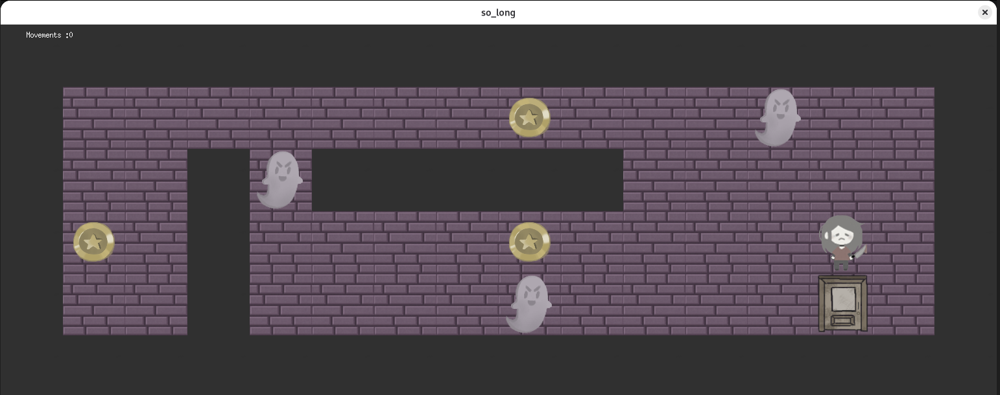
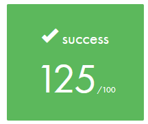

<p align="center"> This project has been created as part of the 42 curriculum by narginaa. </p>
<p align="center">
	
	
	
</p>

<h1 align="center">
 so_long
</h1>
<div align="center">
  
</div>

## 💡 Description


The `so_long` project is a small 2D game built using the **miniLibX** graphics library. <br>
All sprites and visual assets used in the project were drawn by me.

🏆 | The goal is to create a top-down game where the player must collect all the items (coins) on a map <br>
and then reach the exit, all while navigating around walls and keeping track of the total number of movements.
<br clear="both">

## 🛠️ Instructions
### Prerequistes
**For Linux and MacOS**
This project requires the [GNU Compiler Collection](https://gcc.gnu.org/), the [GNU Make](https://www.gnu.org/software/make/) compiler, internet to clone [MiniLibX](https://github.com/42Paris/minilibx-linux#readme) in the libraryfolder and X11 Development Libraries and Headers (`sudo apt-get install libx11-dev`).

### Compilation
To compile the project, run:
```bash
make
```
### Usage
Run the program with a valid `.ber` map file as an argument:
```bash
./so_long assets/maps/valid/map.ber
```
If the map is valid, a graphical window will open, and you can start playing!

## 🧶 Game Mechanics & Rules

- The player must collect all the Collectibles (`C`) on the map.
- Once all collectibles are gathered, the Exit (`E`) will open and the player can step on it to win.
- The player cannot walk through Walls (`1`).
- If the player walks on a Ghost, the game ends.
- Every step the player takes is counted and printed in the terminal.

### Controls
-`W` or `↑` (Up Arrow): Move Up
-`A` or `←` (Left Arrow): Move Left
-`S` or `↓` (Down Arrow): Move Down
-`D` or `→` (Right Arrow): Move Right
-`ESC` or `Q`: Close the window and quit the game cleanly.

## 🗺️ Map Configuration

Maps must be passed as .ber files and adhere to the following rules:

- Must be strictly rectangular.
- Must be completely closed/surrounded by walls (`1`).
- Must contain **exactly one** Player starting position (`P`).
- Must contain **exactly one** Exit (`E`).
- Must contain **at least one** Collectible (`C`).
- Allowed characters: `0`, `1`, `C`, `E`, `P`, (and `G` for the bonus part).

Example of a valid map:
```Text
1111111111111
10010000000C1
1000011111001
1P0011E000001
1111111111111
```
## 🚧 Technical Implementation

### Parsing & Validation Strategy
1. **File Reading**: Uses `get_next_line` to read the map line by line and store it into a 2D array.

2. **Format Checking**: Iterates through the 2D array to ensure the map is rectangular, properly walled off,  
and contains no invalid characters.

3. **Flood-Fill Algorithm (Pathfinding)**: Before the game launches, a **Depth-First Search (DFS) Flood-Fill**  
algorithm  is executed on a copy of the map. It starts from the player's position and spreads to verify that **every single collectible**  
and the **exit** are reachable without walking through walls.  
If any item is trapped, the game throws an error and refuses to launch.

### Graphics & Memory

- **miniLibX**: Used to open the window, hook keyboard inputs, and render `.xpm` textures directly to the screen.
- **Directional Sprites**: The player texture dynamically updates to face the direction they are walking  
(Front, Back, Left, Right).
- **Memory Management**: Ensures proper cleanup of all allocated memory and graphical resources  
All images are destroyed, windows are closed, and map arrays are freed upon exit (`ESC`, `Q`, or clicking the window cross).

## 🔗 Resources

- **42 Curriculum**: Subject PDF and constraints (Norminette, external functions, memory leaks).
- **miniLibX documentation**: For understanding window rendering, image handling, and event hooks.
- **Flood-Fill Algorithm**: Essential for the 42 `so_long` map validation step.
## 📜 License
This project is licensed under the [MIT License](LICENSE).

> [!NOTE]
> All sprites and visual assets located in the `assets/sprites/` (or `img/`) folder were custom-drawn by me.
> If you fork or reuse this project, please credit me for the artwork or replace them with your own assets!

Built by Pand0xra as part of the 42 curriculum.
